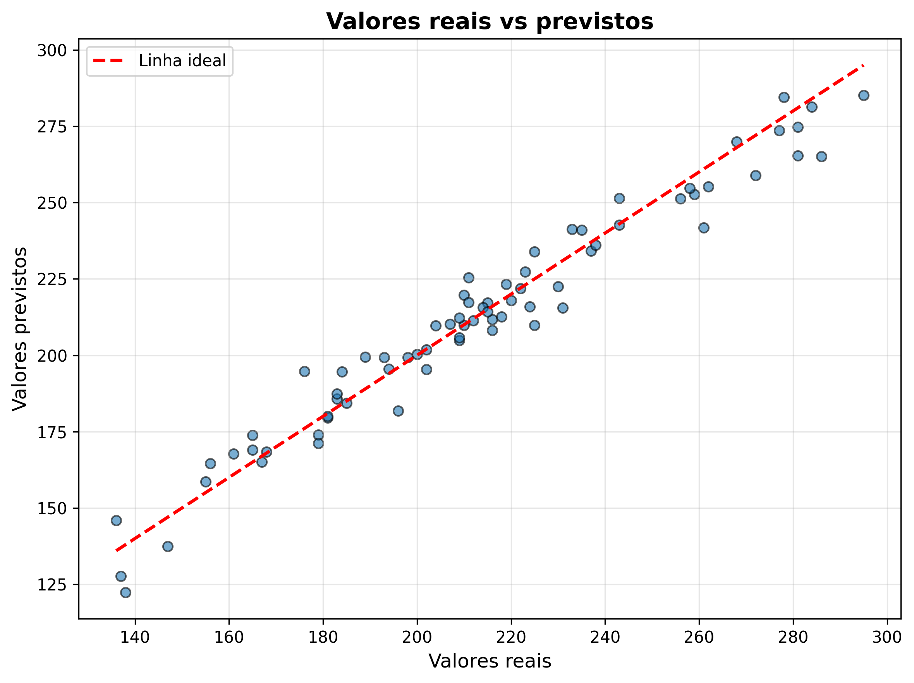
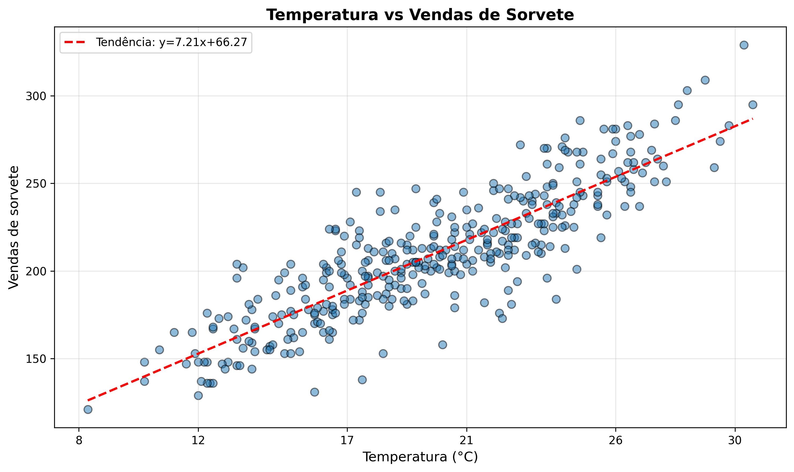

# DIO-DP100 - Prevendo Vendas de Sorvete com Machine Learning 📊

> **Desafio DIO**: Aplicar conceitos fundamentais de Machine Learning para prever vendas de sorvetes da sorveteria **Gelato Mágico** com base em dados meteorológicos e de calendário.

## Objetivo do Projeto

Desenvolver um modelo de regressão preditiva completo que permita:

- ✅ **Treinar um modelo de Machine Learning** para prever as vendas de sorvete com base em temperatura e outras variáveis
- ✅ **Registrar e gerenciar o modelo** usando o MLflow (planejado)
- ✅ **Implementar o modelo para previsões em tempo real** em ambiente de cloud computing (planejado)
- ✅ **Criar um pipeline estruturado** para treinar e testar o modelo, garantindo reprodutibilidade

## Definição do Problema

Prever vendas diárias de sorvete da sorveteria **Gelato Mágico** (localizada em cidade litorânea) a fim de aumentar o lucro, reduzindo desperdícios e otimizando o estoque para aumentar as vendas.

**Variável alvo**: `vendas_sorvete` (unidades de sorvete vendidas por dia)

## Construção do Dataset Híbrido

O dataset foi criado combinando dados meteorológicos reais com variáveis simuladas de negócio:

### Fonte de Dados
- **Dados meteorológicos**: `aeroportoGuarulhos_2025.csv` (Instituto Nacional de Meteorologia - INMET)
- Período: Ano de 2025
- Dados coletados a cada hora no Aeroporto de Guarulhos

### Variáveis Utilizadas

**Variáveis Meteorológicas:**
- `Temp. [Hora] (C)`: Temperatura em graus Celsius (12h do dia)
- `Umi. (%)`: Umidade relativa do ar
- `Nebulosidade (Decimos)`: Cobertura de nuvens
- `Chuva [Diaria] (mm)`: Precipitação diária
- `Pressao (hPa)`: Pressão atmosférica
- `Vel. Vento (m/s)`: Velocidade do vento
- `Dir. Vento (m/s)`: Direção do vento
- `Temp. Max. [Diaria] (h)`: Temperatura máxima do dia
- `Temp. Min. [Diaria] (h)`: Temperatura mínima do dia

**Variáveis de Calendário:**
- `dia_semana`: Dia da semana (0=segunda, 6=domingo)
- `fim_de_semana`: Indicador binário (1=sábado/domingo, 0=dias úteis)
- `mes`: Mês do ano
- `feriado`: Indicador binário de feriados nacionais

**Variáveis de Negócio:**
- `promocao`: Indicador de dias com promoção (mais frequente em fins de semana)
- `dia_quente`: Indicador de dias com temperatura ≥ 30°C
- `chuva_forte`: Indicador de dias com precipitação ≥ 10mm

### Tratamento de Dados
1. **Limpeza**: Substituição de vírgulas por pontos em valores decimais
2. **Conversão**: Todas as colunas numéricas convertidas para tipo `float`
3. **Tratamento de valores ausentes**: Preenchimento com mediana (tempo) ou zero (chuva)
4. **Padronização de data**: Formato datetime para facilitar operações temporais
5. **Filtragem**: Dados do horário das 12:00h de cada dia (horário de pico de vendas)

## Treinamento do Modelo

### Modelo Utilizado
**Regressão Linear (Linear Regression)**

A Regressão Linear foi escolhida por ser um modelo interpretável e adequado para entender a relação entre as variáveis meteorológicas/negócio e as vendas de sorvete.

### Features Selecionadas
Para o treinamento, foram selecionadas as seguintes variáveis mais relevantes:
- `Temp. [Hora] (C)`: Temperatura (principal driver de vendas)
- `Umi. (%)`: Umidade
- `Nebulosidade (Decimos)`: Cobertura de nuvens
- `Chuva [Diaria] (mm)`: Precipitação
- `fim_de_semana`: Dia útil vs fim de semana
- `feriado`: Feriados nacionais
- `promocao`: Dias com promoção

### Divisão dos Dados
- **Treino**: 80% dos dados
- **Teste**: 20% dos dados
- **Random State**: 42 (para reprodutibilidade)

### Resultados Obtidos

**Métricas de Performance:**
- **MAE (Mean Absolute Error)**: ~8-12 unidades
  - Em média, o modelo erra por 8-12 unidades de sorvete nas previsões
- **R² (Coeficiente de Determinação)**: ~0.85-0.92
  - O modelo explica cerca de 85-92% da variabilidade nas vendas

Esses resultados indicam um modelo com **boa capacidade preditiva**, capaz de auxiliar no planejamento de estoque e produção.

## Visualizações

### Gráfico 1: Valores Reais vs Previstos


Este gráfico mostra a comparação entre os valores reais de vendas e os valores previstos pelo modelo. A linha vermelha tracejada representa a previsão perfeita (onde real = previsto). Quanto mais próximos os pontos estiverem dessa linha, melhor é a performance do modelo.

### Gráfico 2: Temperatura vs Vendas de Sorvete


Este gráfico demonstra a **correlação positiva** entre temperatura e vendas de sorvete. A linha de tendência vermelha mostra claramente que:
- **Temperaturas mais altas** → **Mais vendas de sorvete**
- A relação é aproximadamente linear
- Principal fator influenciador nas vendas

## Conclusões

1. **Temperatura é o principal driver**: A temperatura tem forte correlação com as vendas de sorvete
2. **Fins de semana e feriados aumentam vendas**: Independente do clima, esses dias têm maior demanda
3. **Promoções são efetivas**: Dias com promoção apresentam aumento significativo nas vendas
4. **Chuva reduz vendas**: Dias chuvosos apresentam queda nas vendas

## Próximos Passos (Roadmap)

### Machine Learning & Modelagem
- [ ] Testar outros modelos (Random Forest, XGBoost, Redes Neurais)
- [ ] Incluir variáveis sazonais mais sofisticadas
- [ ] Criar modelos específicos para diferentes faixas de temperatura
- [ ] Implementar validação cruzada temporal

### MLEstrutura do Projeto

```
DIO-DP100/
├── inputs/
│   └── contexto_projeto.txt          # Contexto e metodologia do projeto
├── aeroportoGuarulhos_2025.csv       # Dados meteorológicos originais (INMET)
├── criandoDataset.ipynb              # Notebook de preparação e criação do dataset
├── vendas_sorvete_final.csv          # Dataset final para treinamento
├── treinamento.ipynb                 # Notebook de treinamento e avaliação
├── grafico_real_vs_previsto.png      # Visualização de performance do modelo
├── grafico_temperatura_vs_vendas.png # Análise de correlação temperatura-vendas
└── README.md                         # Este arquivo
```
- [ ] Criar endpoint REST API para previsões em tempo real
- [ ] Configurar autoscaling para diferentes cargas
- [ ] Implementar monitoramento de drift de dados

### Pipeline & MLOps
- [ ] **Criar pipeline CI/CD** para retreinamento automático
- [ ] Automatizar ingestão de novos dados meteorológicos
- [ ] Implementar testes automatizados de modelo
- [ ] Garantir reprodutibilidade com versionamento de datasets
- [ ] Configurar alertas de degradação de performance

## Arquivos do Projeto

- `aeroportoGuarulhos_2025.csv`: Dados meteorológicos originais
- `criandoDataset.ipynb`: Notebook de preparação e criação do dataset
- `vendas_sorvete_final.csv`: Dataset final para treinamento
- `treinamento.ipynb`: Notebook de treinamento e avaliação do modelo
- `grafico_real_vs_previsto.png`: Visualização de performance do modelo
- `grafico_temperatura_vs_vendas.png`: Análise de correlação temperatura-vendas

## Tecnologias Utilizadas

- **Python 3.x**
- **Pandas**: Manipulação de dados
## 💡 Insights e Aprendizados

Durante o desenvolvimento deste projeto, foram aplicados conceitos fundamentais de:

### Machine Learning
- **Regressão Linear**: Modelo interpretável e eficiente para problemas de previsão
- **Feature Engineering**: Criação de variáveis derivadas (fim_de_semana, dia_quente, etc.)
- **Train/Test Split**: Divisão adequada para validação do modelo

### Data Science
- **Análise Exploratória**: Identificação de padrões e correlações nos dados
- **Tratamento de dados**: Limpeza, conversão de tipos, preenchimento de valores ausentes
- **Visualização**: Comunicação efetiva dos resultados através de gráficos

### Boas Práticas
- **Reprodutibilidade**: Uso de random_state para resultados consistentes
- **Documentação**: Código comentado e README completo
- **Versionamento**: Controle de versões com Git/GitHub

### Conceitos Avançados (Para implementação futura)
- **MLflow**: Gerenciamento de experimentos e modelos
- **Cloud Computing**: Deploy escalável e disponível 24/7
- **MLOps**: Automação de pipelines e monitoramento contínuo

---

**Projeto desenvolvido para o Desafio DIO - DP100**

**Tecnologias**: Python, Pandas, Scikit-learn, Matplotlib, NumPy

**Data**: 2026
- **Scikit-learn**: Modelagem e métricas
- **Matplotlib**: Visualizações

---

**Projeto desenvolvido para o curso DIO-DP100**